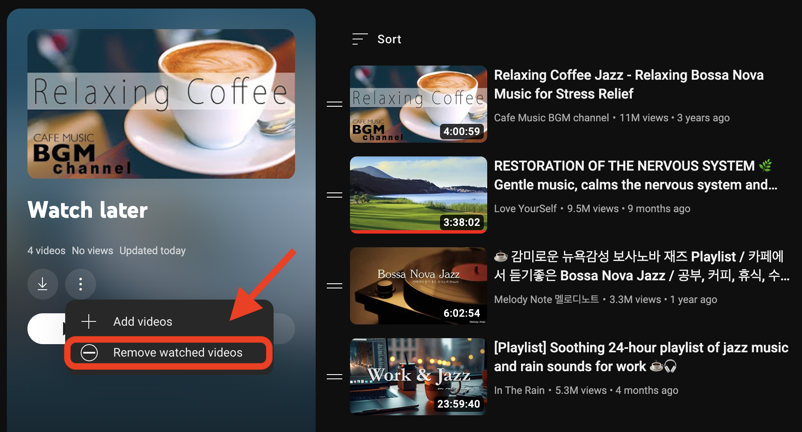
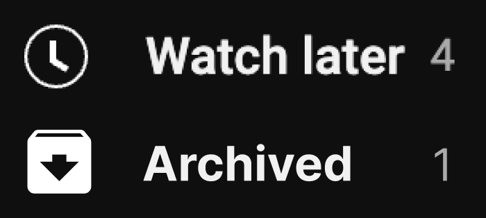

# The Problem

I frequently use the "Watch Later" feature on YouTube, as it allows me to quickly save videos that catch my interest without spending too much time watching everything on my feed. This feature enables me to watch these videos at my convenience, knowing that they will remain accessible until I am ready to view them. It’s available everywhere phone, tablet, desktop, and TV.

However, I'm frustrated by the fact that there's no efficient way to manage watched videos. Once a video is watched, it stays in the "Watch Later" playlist, and you can only bulk remove them. To archive them, you need to manually add them to a playlist, which is time-consuming if you watch a lot of videos.

 

  
   
  <em>You can only bulk removed watched videos from Watch Later, not archive them.</em>

# The Solution

It would be nicer if the watched videos from Watch Later is moved to Archived playlist instantly after being watched, so I don’t accidentally removed a great video that I watched 6 months ago cause I’m clearing Watch Later.

 

  
   
  <em>Watch Later should have archive automation.</em>

# Technical Specs

With Serverless Functions, OAuth2.0 and Youtube API, this automation would be possible. Since the YouTube API is RESTful, real-time updates would be difficult, but they aren't necessary. Using CRON jobs hourly or daily should suffice.